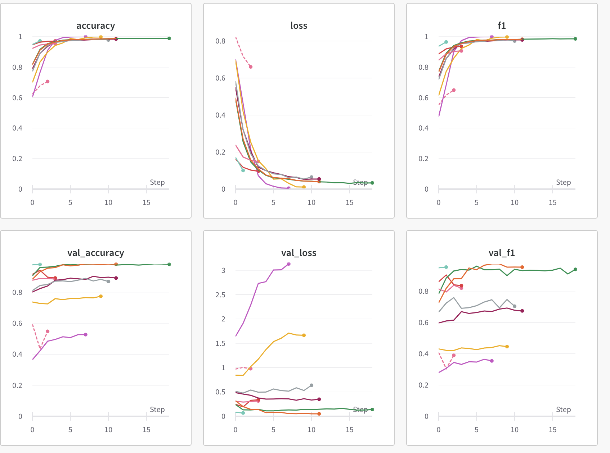
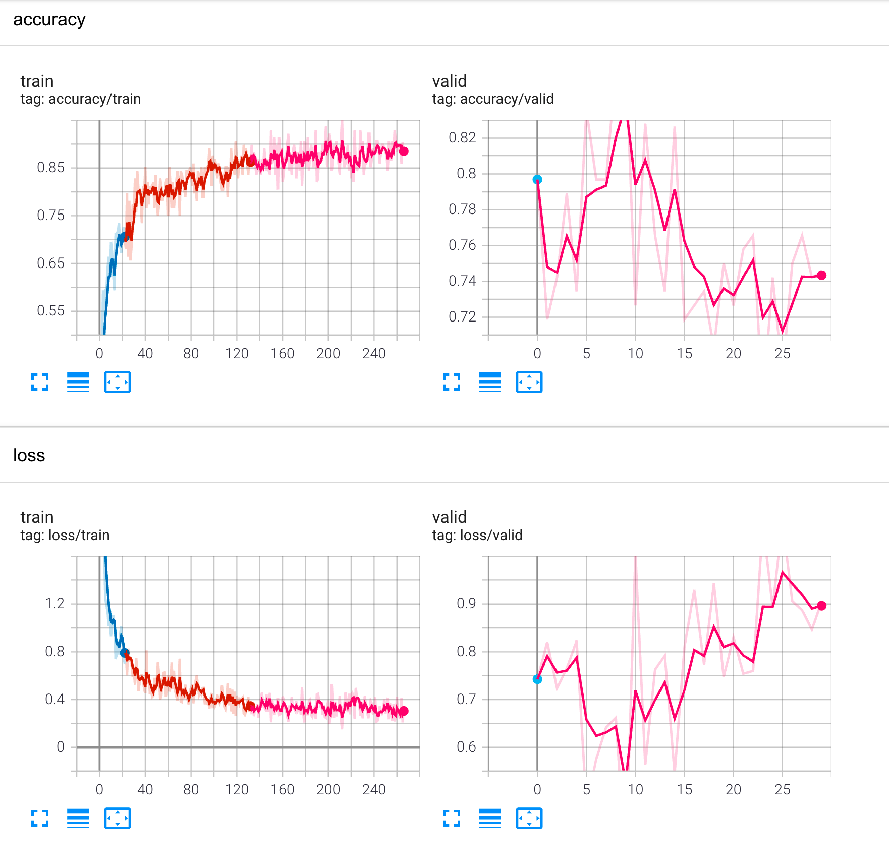
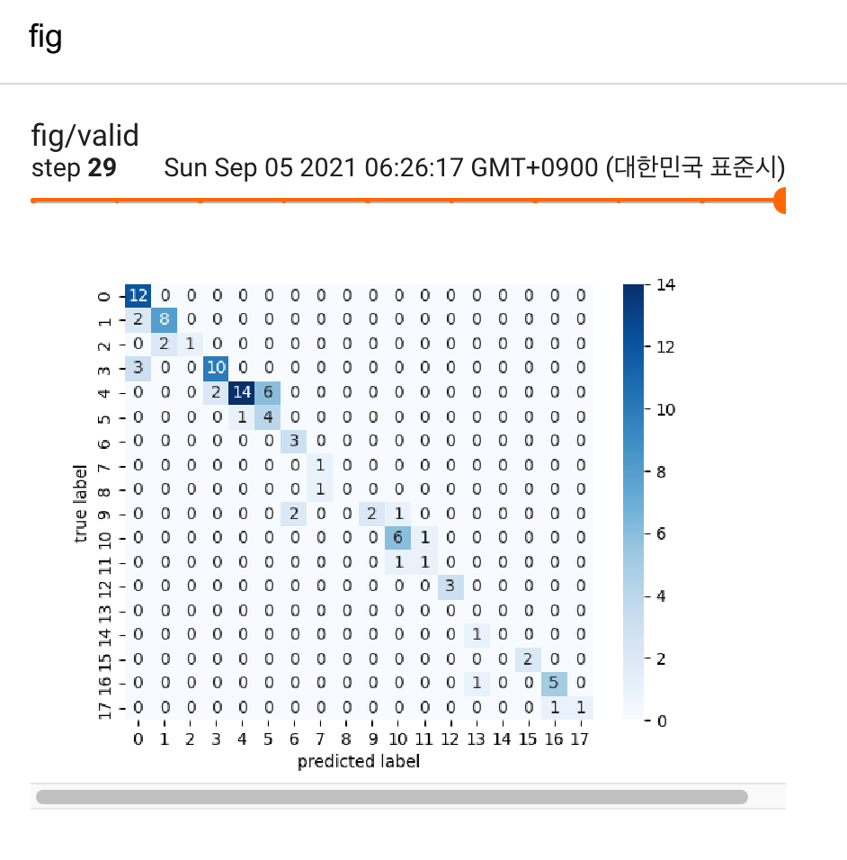

# Efficient baseline using pytorch template

This pytorch template is for Image Classification of AI Competition.
Diffrence between original pytorch-template and efficient baseline is as follows.

- Can use hard splitted valid_data_loader
- Can add logs in wandb
- Add custom_dataset & custom_valid_dataset
- Can use albumentations not transforms in torchvision
- Can see Confusion Matrix figure in tensorboard
- Can change pretrained model (in timm) simply change to argument of config.

## Requirements
```
Python >= 3.5 (3.6 recommended)
PyTorch >= 0.4 (1.2 recommended)
tqdm (Optional for test.py)
tensorboard >= 1.14 (see Tensorboard Visualization)
wandb >= 0.12.1 (see Wandb Visualization)
sklearn >= 0.24.2
matplotlib >= 3.2.1
seaborn >= 0.11.2
timm >= 0.4.12
```

## Causions

1. ***You must change TODO***
    ```shell
    custom_dataset.py # dataset path
    data_loader.py # augmentations
    model.py # if you use other model that is not in timm
    train.py # init your wandb account
    ```

2. ***And this code uses '.csv' file. Csv file should have image's path and label.***

## Config

```
{
    "name": "YOUR_MODEL_NAME",
    "n_gpu": 1,
    "arch": {
        "type": "Model", # Model class name (in model.py)
        "args": {
            "num_classes": 10, # Number of classes
            "pretrained_model": "efficientnet_b0" # This is pretrained model name of timm
        }
    },
    "data_loader": {
        "type": "CustomDataLoader", # your data loader
        "args": {
            "data_dir": "YOUR_DATA_DIR", # your data dirs
            "batch_size": 128,
            "shuffle": true,
            "validation_split": 0.0,
            "num_workers": 4,
            "csv_path": "YOUR_TRAIN_CSV_FILE_PATH" # your csv path
        }
    },
    "valid_data_loader": {
        "type": "CustomValidDataLoader", # your valid data loader
        "args": {
            "data_dir": "YOUR_VALID_DATA_DIR", # your valid data dirs
            ...
            # your valid csv path if you don't have valid dataset, you can use Sampler in base_data_loader.py
            "csv_path": "YOUR_VALID_CSV_FILE_PATH" 
        }
    },
}
```

## Appendix







## Reference

[Pytorch Custom Dataset Examples](https://github.com/utkuozbulak/pytorch-custom-dataset-examples#incorporating-pandas)